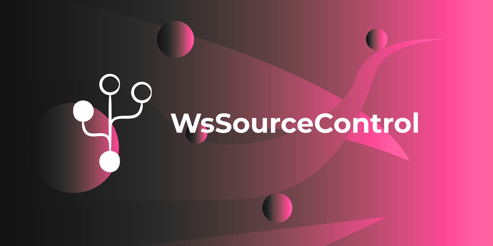

  

# WsSourceControl

A simple [Flax Engine](https://flaxengine.com/) plugin that adds a basic Git-based source control overview directly inside the Flax Editor. (Ws stands for Wavestorm).

## Features

- **Editor toolbar integration** — Source Control button in the ToolStrip and Window menu (F8 shortcut)
- **Top Toolbar** — Quick access to Refresh, Fetch, Pull, and Push operations directly from any tab
- **Bottom Status Bar** — Constant visibility of current branch, ahead/behind status, and async operation progress
- **Changes tab** — Staged/unstaged file trees with color-coded change types, right-click context menus (stage, unstage, discard, open in explorer), inline diff viewer, and commit with amend support
- **History tab** — Commit log browser with search/filter by hash, author, or message, and a detail panel showing full commit info and changed files
- **Branches tab** — Local and remote branch listing, checkout, delete, create new branch with auto-checkout
- **Sync tab** — Stash management (stash, pop, apply, drop list), merge conflict detection and file listing
- **Git initialization** — One-click Git repo initialization if the project isn't already a Git repository
- **Async git operations** — Background thread execution with main-thread callback marshalling for non-blocking UI and error popups

## Installation

1. Copy the `WsSourceControl` folder into your Flax project's `Plugins/` directory
2. Regenerate project files and rebuild

## Requirements

- Flax Engine 1.12+
- Git installed and available in PATH

## License

Copyright © Wavestorm Software. All rights reserved.
